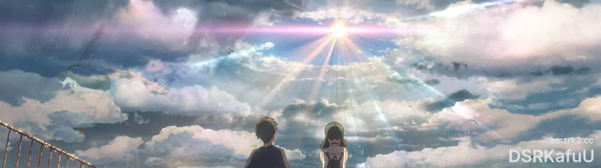
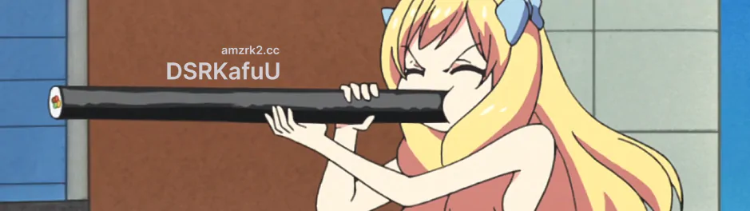

> 给自己的笔记：四种状态分别为追番、补全、回放和抛弃，前三种均为完成状态。

收藏列表于页面最下。至于列表为什么要分出未定部分，就个人来说，时间会很大程度上影响对一部动画的感觉。移出预留列表，就意味着这是一部在多次回放的基础上，**对我来说**依旧是属于很高评价的作品。

<!--more-->

## 2020 年 12 月

**追番 - 在魔王城说晚安「魔王城でおやすみ」**

小水和松冈是最初点开这部作品的原因，小水的水平越来越高了，OP 找回了越共的感觉；本作就是属于那种设定和画风都不感兴趣、但追起来却是意外有趣的类型，在本季度番剧中属于上游水平，推荐一看。

**追番 - 魔女之旅「魔女の旅々」**

本季度追番里面第一部完结的，在隔壁麻子和小高很符合大家 "期望" 的情况下，魔女之旅已经可以算是本季度相对优秀的作品了。部分剧情的合理性先不论，做人设做的非常不错，谁不喜欢白毛自恋抗吧公主呢。

## 2020 年 11 月

**补全 - 我的青春恋爱物语果然有问题 完「やはり俺の青春ラブコメはまちがっている。完」**

春物第三季看下来最大的感受是自己已经看不来这种类型的动画了，后面几集开始逐渐变成一边打游戏一边挂着看两眼，完全没有小时候追小说时期的那种感觉。BGM 分数我给了 6/10，完结了总之是好事，动画制作本身也是正常水平，只不过看完春物、我更觉得白色相簿着实是十分优秀的作品了。

## 2020 年 10 月

**回放 - 魔法科高校的劣等生「魔法科高校の劣等生」**

新一季出了，简单回看下前作。这部番最大的优点集中于制作，相对来说在 14 年属于非常不错的，OP、ED 以及其他 BGM 都非常优秀；缺点则主要有两点，第一点是初看优秀但细看又缺少细节、以及由于原作者导致的不合理政治设定的不平衡世界观，第二点则是后期横滨骚乱篇角色塑造明显弱于前期入学和九校战篇，这也是龙傲天类番剧必然会走向的情况。

## 2020 年 9 月

**追番 - 刀剑神域 Alicization War of Underworld -THE LAST SEASON-「ソードアート・オンライン アリシゼーション War of Underworld -THE LAST SEASON-」**

搞笑番。

**追番 - 某科学的超电磁炮 T「とある科学の超電磁砲 T」**

日常轻喜剧，拿来放松看看很不错。真心话，这季 JC 的发挥相当不错，虽然因为疫情导致了不断的延期，但是质量依旧有保证，再让隔壁的刀剑一衬托，可以说是预料之上的发挥了。

**追番 - 放学后海堤日记「放課後ていぼう日誌」**

喜欢摇曳露营的不会不喜欢钓鱼，顺便还因为这部番认识了几个有趣的钓吧老哥。

**补全 - 黑社会的超能力女儿「ヒナまつり」**

日常轻喜剧，拿来放松看看很不错。

**补全 - 月色真美「月がきれい」**

大学了依然没有初恋，但我给出 8 分。在人物的刻画上非常优秀，全剧看完能了解每个人物的情感与性格，ED 后和 SP 的真实小剧场也很有趣。

## 2020 年 8 月

**补全 - 中二病也要谈恋爱！-Take On Me-「映画 中二病でも恋がしたい！-Take On Me-」**

剧场版在第二季播出四年后才上映，其中也加入了很多彩蛋，最明显的就是玉子市场相关的内容了。这作剧场版的整体节奏让人非常舒服、安心，中期叙事其实有一点点凉宫 Someday in the Rain 的感觉，但是又加入了相当的多的搞笑元素，小剧场和部分插入的线稿风格也很有意境。作为系列的结束是非常优秀的一作，甜甜的 "Happy Ending" 真的很棒。

**回放 - 中二病也要谈恋爱！S1-S2「中二病でも恋がしたい！S1-S2」**

为一直忘记观看的剧场版预热。中二病在京阿尼作品系列中还是有相当的独特之处的，与常见的清淡、少女化表现方式不同，她非常热烈，因此其实能从中感受到比绝大多数标准狗粮番更加令人治愈的情感。但就 TV 两季作品本身而言、其也是存在很多小问题的，特别是第一季中后六花家庭相关的部分，在很多表现上确实观感有些奇怪。

**回放 - 樱花庄的宠物女孩「さくら荘のペットな彼女」**

樱花庄其实也算 JC 巅峰时期作品吧，虽然放到现在、无论是人设还是剧情都已经偏向 "标准化"，但在当时已经属于相当不错的作品了。鸭志田一老师的作品观感向来是相当不错的，继樱花庄之后的青春猪头少年系列也是非常有趣的作品。

**补全 - 玉子爱情故事「たまこラブストーリー」**

**补全 - 玉子市场「たまこまーけっと」**

JK + 山田尚子、轻音三作和玉子两作，代表了我心目中少女日常及人物细节表现的最高水平。Bangumi 有些老哥们说的京阿尼少女 "着衣裸体" 确实是有些过于夸张化了，但是京阿尼的少女、确实是展现出了令人难以拒绝的 "少女感"，而到目前为止我只在京阿尼这里见到过如此高水平的表现力。

**回放 - 剧场版 吹响！悠风号～誓言的终章～「劇場版 響け！ユーフォニアム～誓いのフィナーレ～」**

说来五月份才刚看过，也不觉得腻。南中势力确实是有点可惜了，至于一年生，历史和我都会选择久石奏的（实在是太香了

**回放 - 天气之子「天気の子」**

这是所有诚哥作品中我最喜欢的一作，距离去年 11 月在影院看完后快一年再研究一遍 BD。针对天气之子本身，我永远坚持的是我走出影院时的观点。"小孩子的胡闹"？"简单的电车难题"？又或者是 "比你名差远了"？天气之子没必要、也不应该和你的名字进行对比，当然就故事而言在我眼里也不存在什么电车难题。拯救家园和自己所爱之人、如果有这样的选择，选择哪个？我只可能选择后者。

**回放 - 吹响！悠风号 S1-S2「響け！ユーフォニアム S1-S2」**

多线并行的结果就是一开始看就根本停不下来。

## 2020 年 7 月

**回放 - 凉宫春日的消失「涼宮ハルヒの消失」**

**回放 - 凉宫春日的忧郁 06-09「涼宮ハルヒの憂鬱 06-09」**

和之前的断断续续不同，这次我是一次性完整的把八集漫无止境的八月全部连续过完的。我非常不赞同有些人的 "只看一和八" 或是 "全都一样没啥好看" 的观点，用 2015 年果子的广告词来说这八集的内容、"唯一的不同，是处处都不同"。无论是从剧情的小细节、道具和作画还有部分内容的编排，每集都有不同的特点；特别是其中 EP15 逐渐显现的京都脸、还是 EP16 石原极为优秀的分镜和演出都值得花时间完整的看一遍；在此强烈推荐没有完整观看这些单集的朋友们能够抽出时间欣赏一遍。记于 2020 年 7 月 20 日。

**回放 - 幸运星「らき ☆ すた」**

阿宽虽然你情商真的很低、行为也很蠢，但是你编舞的样子真的好靓仔 (

**追番 - 隐瞒之事「かくしごと」**

非常棒的动画，第一眼的画面就令人十分舒适，特别是在夏天吹着空调看，能让人完全放心下来。故事本身也足够有趣，结局也是我喜欢的类型，整体完成度非常高。是那种初看十分平淡普通，但追完回头一想全是加分点的作品。

**追番 - 公主连结 Re:Dive「プリンセスコネクト！Re:Dive」**

我个人对这个类型的游戏是完全不感兴趣的，觉得过于花时间和精力、本身也并不喜欢公会之类的机制，因此游戏一定是不回去投入玩的。但是就改编动画来说这是一部十分优秀的动画，来凑热闹的也能看来消磨时间、推广作用也起到了、本身 CyPictures 的画面风格也十分戳中我，值得一看。

**补全 - 小魔女学园「リトルウィッチアカデミア」**

扳机传统艺能日常出现。

## 2020 年 6 月

**追番 - 辉夜大小姐想让我告白？～天才们的恋爱头脑战～「かぐや様は告らせたい？～天才たちの恋愛頭脳戦～」**

球球尼门快加把劲骑士吧！

**回放 - 映画けいおん！「轻音少女 剧场版」**

六月京阿尼大回顾，距离初见 K-ON 已经快八年了。若是对于一个今天的初见者，应该很难想象她来自 2009 年吧。一部超越时代的动画，第一季播出到现在 11 年，之间的无数动画中都能找到轻音的影子，这就是最好的证明。

**回放 - けいおん！S1-S2「轻音少女 S1-S2」**

**回放 - 冰菓「氷菓」**

14 岁那年、看冰菓，平淡的就过去了；上大学了、看冰菓，给了人完全不同的感受，这类能让人静下心来欣赏的作品我向来是很喜欢的。最后在事件快一年过去的今天，愿武本康弘监督以及其他逝者安息。

## 2020 年 5 月

**补全 - 剧场版 吹响！悠风号～誓言的终章～「劇場版 響け！ユーフォニアム～誓いのフィナーレ～」**

熟悉的京吹，熟悉的味道，把能做一季动画的内容塞进一个剧场版，节奏快却没有赶的感觉。期待久美子三年级篇，京阿尼加油！

**回放 - 你的名字。「君の名は。」**

距离大陆首映已经三年多过去了，2016 的 12 月，我还是一个混日子的高中生，在周日上午半天课程结束后卡着时间跑到电影院，结束后又回到家开始赶作业。剧中三年，现实也三年。现今对于它已经没有什么可以评价的了，全网搜索可以看到无数影评。无论别人如何分析逻辑、剧情，如何和其他优秀作品对比，我只想说，它真正完美满足了我对一部优秀的剧场版拥有的所有要求和期待，这就足够了。

**补全 - 异度侵入 ID:INVADED「ID:INVADED イド：インヴェイデッド」**

值得一看。春哥人设特棒，津叔演技极佳。总体来看没有大的逻辑问题和漏洞，在这一类动画中属于相当值得一看的类型了。

## 2020 年 4 月

**补全 - DARLING in the FRANXX「ダーリン・イン・ザ・フランキス」**

17 年底、18 年初的时候，网络讨论的热度很高；在快播完的时候，网络评价相对很差；整个放送周期正好是我现实中最忙碌的时期。这三点原因让我把它留了下来。两年后的 2020 年蹲家的时候，终于有时间翻了出来，花了六天稳定补完，期间没有看任何网络弹幕和评论。在完全 "原生态" 观看完毕再翻查评论之后，我得出的结论是 DITF 是一部很普通的动画。它远没有部分平台上人群评价的史诗烂作那么差，自然也没有大家一开始所期待的那么优秀。它最大的问题其实是造了一个很坚实、很稳固的地基，也准备了一张很大的设计图，但是过于注重于建筑物部分的设计却没有考虑到怎么有效组合，导致高开低走节奏失调，这种感觉在整个 20 集以后涉及 VIRM 的部分尤其明显。但是就全篇而言，内容方面的人物刻画和部分单集、制作方面的总体作画音乐，甚至能归到中等偏上水平，13 集更是全剧经典。因此，至少在我个人的评价上，以 Bangumi 的评分梯度应该会给 6.5 分，算上部分个人很喜欢的单集平均 7 分总分，现在平均 5.9 的分很明确的是低了，也希望部分听了评价而没去看的朋友在有空闲的时候去看一看 —— 以追一部普通动画的心态。

**追番 - 邪神与厨二病少女’「邪神ちゃんドロップキック’」**

第二季真的很棒！最后的 11 集虽然内容不多，但绝对是个加分点。从这部番本身来说，在第一遍看了、笑过之后，心里会想到一些东西。真正优秀的日常向、欢乐向的番总是这样，在沉浸其中、又回归现实之后能引发一些思考，正是这一类番剧的魅力所在。

**补全 - 邪神与厨二病少女「邪神ちゃんドロップキック」**

**回放 - 食戟之灵 S1-S4「食戟のソーマ S1-S4」**

总的来说对这个系列的最高评价给第一季，其次给第三季，二四两季相对差点，但是太认真就没意思了，看药王还是得晚上一遍恰泡面一边看，休闲、快乐。至于第五季药哥嘛，还不确定到时候要不要追。

**回放 - 我的青春恋爱物语果然有问题 续「やはり俺の青春ラブコメはまちがっている。続」**

虽然渡航老贼的说法是一开始就想好了结局，但是在小说已经完结的现在再看二季的最后一集，也能发现大老师那句话已经基本把结局展现出来了。

**回放 - 我的青春恋爱物语果然有问题「やはり俺の青春ラブコメはまちがっている。」**

为第三季预热一下，在已经看完 14 卷之后从头翻动画，倒是能看到不少在后面反映出来的小细节内容。

## 2020 年 3 月

**回放 - 白箱「SHIROBAKO」**

现实中可能确实没有喵森那样可爱又能干的制作进行，但是现实中有这部存在可爱又能干的制作进行的动画哟。

**追番 - 虚构推理「虚構推理」**

岩永可爱，糖很喜欢，可惜剧情确实是一遍玩手游一边看的，没有被吸引到注意力，中等评价吧。

**追番 - 房间露营 △「へやキャン △」**

せやな——

**补全 - 为美好的世界献上祝福！红传说「この素晴らしい世界に祝福を！紅伝説」**

E x p l o s i o n !

**抛弃 - 碧蓝之海「ぐらんぶる」**

这个月看了不少快乐的番，于是受朋友推荐再来看看别的。说实话，人各有自己的想法，而我实在是不太喜欢这些学长的行为，无论他们的出发点到底是好事还是坏事，总之暂时弃了。

**回放 - 极黑的布伦希尔特「極黒のブリュンヒルデ」**

想着把完结的漫画看完，就回来先看看动画了，看到一半才想起来好像后面改的不怎么样来着。节奏快了点，压缩的比较厉害。

**补全 - 男子高中生的日常「男子高校生の日常」**

看完女高回来看男高，但是个人并不是很对味。

**补全 - 女高中生的无所事事「女子高生の無駄づかい」**

辉夜看完上瘾了，找起了其他快乐一点的番，电波完全对上了，从头到尾快乐没停过，很赞，BDRIP 收了。

**补全 - 辉夜大小姐想让我告白「かぐや様は告らせたい～天才たちの恋愛頭脳戦～」**

曾经席卷舞蹈区的 ED，一直没看，想到了这部番就来补一下，没想到自己会看的这么开心。

## 2020 年 2 月

**补全 - 少女与战车 最终章第 2 话「ガールズ&パンツァー 最終章第 2 話」**

乳法 1/1，水島努天下第一。

**回放 - 少女与战车 TV+OVA+SP+剧场版+最终章第 1 话「ガールズ&パンツァー TV+OVA+SP+劇場版+最終章第 1 話」**

最终话的第二部资源出来了，把前面所有的补一下，包括第一季、OVA、战车饺子、剧场版和最终话第一部。

**补全 - 青春笨蛋少年不做怀梦美少女的梦「青春ブタ野郎はゆめみる少女の夢を見ない」**

相当不错的剧场版，看完之后补了一下原作的细节，可能是受限于剧场版的时间，一些细节上做出来的话会更棒。

**回放 - 青春笨蛋少年不做兔女郎学姐的梦「青春ブタ野郎はバニーガール先輩の夢を見ない」**

为了补全剧场版，把第一季回看一遍，咲太老师受我一拜。

**回放 - 关于我转生变成史莱姆这档事「転生したらスライムだった件」**

先接触的小说，听闻要出第二季就再看一遍，设定上很喜欢。

**补全 - OVERLORD 1-3「オーバーロード 1-3」**

闲着看看，设定挺有趣，总体表现一般，也不知道为什么，纯龙傲天番里面只有抗中奇侠反倒是留给了我深刻的印象。

## 2020 年 1 月

**回放 - 某科学的超电磁炮 S「とある科学の超電磁砲 S」**

为追第三季做准备，第二季表现力比第一季确实好，也有可能是妹妹篇原作的加成。

**回放 - 某科学的超电磁炮「とある科学の超電磁砲」**

为追第三季做准备，都是回忆。

**抛弃 - 魔法纪录 魔法少女小圆外传「マギアレコード 魔法少女まどか ☆ マギカ外伝」**

**抛弃 - 因为太怕痛就全点防御力了「痛いのは嫌なので防御力に極振りしたいと思います。」**

与网游相关的设计实在是难以接受。

**抛弃 - 别对映像研出手！「映像研には手を出すな！」**

**补全 - 比宇宙更远的地方「宇宙よりも遠い場所」**

由 NGNL 而来，久仰大名。

**追番 - 刀剑神域 Alicization 篇「ソードアート・オンライン アリシゼーション」**

就个人来说，看刀剑已经变成了一种类似 "固定任务" 的存在了，其本身的标准中等水平质量也符合这样的设定。

**追番 - 慎重勇者「慎重勇者」**

作画偶尔有点拉跨，作为无聊之际放松心情追着看还是不错的。

## BD

|  STATUS  |  DATE   |                 NAME                 |        PROD        |
| :------: | :-----: | :----------------------------------: | :----------------: |
| CHECKING | 2020.02 |           劇場版 SHIROBAKO           |     P.A.WORKS      |
| PENDING  | 2019.07 |               天気の子               |  CoMix Wave Films  |
| PENDING  | 2018.04 | ガールズ&パンツァー 最終章 第 1-2 話 |      アクタス      |
| FINISHED | 2016.12 |              君の名は。              |  CoMix Wave Films  |
| FINISHED | 2016.01 |           暗殺教室 第 2 期           |       ラルケ       |
| FINISHED | 2015.11 |      ガールズ&パンツァー 劇場版      |      アクタス      |
| FINISHED | 2015.01 |               暗殺教室               |       ラルケ       |
| FINISHED | 2014.10 |              SHIROBAKO               |     P.A.WORKS      |
| FINISHED | 2014.04 |         たまこラブストーリー         | 京都アニメーション |
| FINISHED | 2013.01 |           たまこまーけっと           | 京都アニメーション |
| FINISHED | 2012.10 |         ガールズ&パンツァー          |      アクタス      |
| FINISHED | 2012.04 |                 冰菓                 | 京都アニメーション |
| FINISHED | 2011.12 |            映画けいおん！            | 京都アニメーション |
| FINISHED | 2010.04 |             けいおん！！             | 京都アニメーション |
| FINISHED | 2009.04 |              けいおん！              | 京都アニメーション |
| FINISHED | 2007.04 |             らき ☆ すた              | 京都アニメーション |
