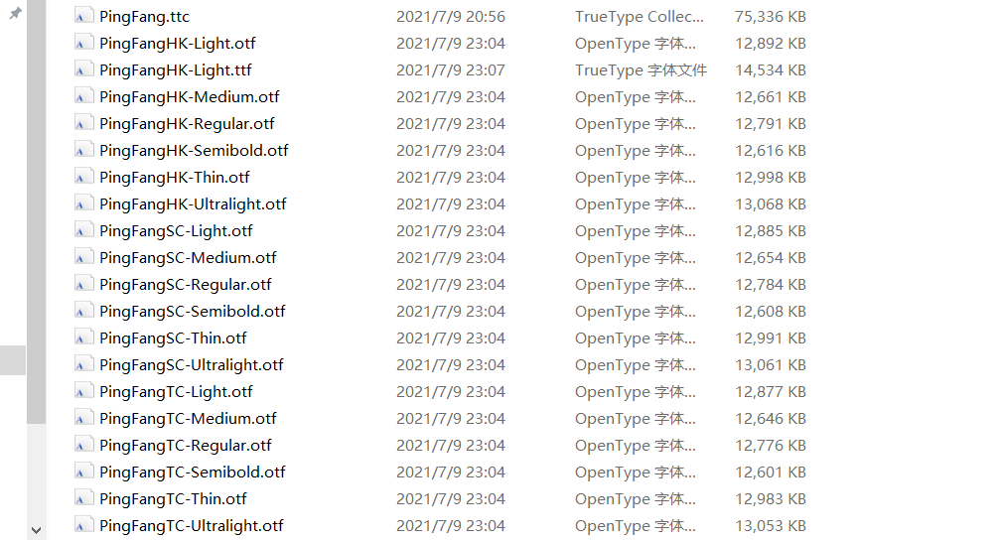

> 注意：未经授权修改与使用 PingFang 字体是侵犯 Apple 公司版权的行为

此文章持续更新从 macOS Catalina 及之后版本中提取的新版苹方字体，包含从 TTC 字体集中提取的 HK、SC 和 TC 三个版本。字体已经过修改，Windows 中可以直接使用。

<!--more-->

## 更新记录

- **2023-09-28** 更新 macOS Sonoma 字体版本 `19.0d5e3`
- **2022-10-29** 更新 macOS Ventura 字体版本 `18.d1`
- **2021-10-26** 更新 macOS Monterey 字体版本 `17.d1e2`
- **2021-07-09** 更新 macOS Big Sur 字体版本 `16.d4e0`
- **2020-05-01** 更新 macOS Catalina 字体版本 `15.0d2e5`

## 提取方法

### 提取源字体

根据[苹果官网的预置字体清单](https://support.apple.com/zh-cn/HT210192)，决定使用 Catalina 作为文件来源，预置的苹方字体版本为 `15.0d2e5`。

从 Catalina 系统内的 `/System/Library/Fonts` 内取出 `PingFang.ttc` 即可。

### TTC 解包

使用 Adobe Font Development Kit for OpenType 的 Python 脚本 `otc2otf.py` ([下载地址](https://blogs.adobe.com/CCJKType/files/2014/01/otc2otf.py)) 将 `PingFang.ttc` 解包为各字重分开的 OpenType 字体文件：

```bash
python otc2otf.py -w PingFang.ttc
```

注意 `otc2otf.py` 需要在 Python 2 下运行。解包会将 PSNameUndefined.otf 一起提取出来，由于对移植没什么用删除即可。最终得到如下文件：



### 移植方法

解包获取的字体由于没有 Windows 平台的 CMap，因此无法在 Windows 下直接安装使用。在最初的 DP1 版本中，只需对 ttc 文件进行解包即可在 Win­dows 下正常使用，而 DP2 之后的版本却不能这样，其根本原因是 DP1 版本的字体有以下 4 个 CMap 子表：

```html
<cmap_for­mat_4 plat­formID="0" pla­tEn­cID="3" lan­guage="0">
  <cmap_for­mat_12
    plat­formID="0"
    pla­tEn­cID="4"
    for­mat="12"
    re­served="0"
    length="185584"
    lan­guage="0"
    nGroups="15464"
  >
    <cmap_for­mat_4 plat­formID="3" pla­tEn­cID="1" lan­guage="0">
      <cmap_for­mat_12
        plat­formID="3"
        pla­tEn­cID="10"
        for­mat="12"
        re­served="0"
        length="185584"
        lan­guage="0"
        nGroups="15464"
      ></cmap_for­mat_12>
    </cmap_for­mat_4>
  </cmap_for­mat_12>
</cmap_for­mat_4>
```

而 DP2 之后的版本却变成了 2 个 CMap 子表：

```html
<cmap_for­mat_4 plat­formID="0" pla­tEn­cID="3" lan­guage="0">
  <cmap_for­mat_12
    plat­formID="0"
    pla­tEn­cID="4"
    for­mat="12"
    re­served="0"
    length="189520"
    lan­guage="0"
    nGroups="15792"
  ></cmap_for­mat_12>
</cmap_for­mat_4>
```

由于缺乏 `plat­formID` 为 `3` 的子表，Win­dows 将其视为了无效的字体文件。将 DP2 之后的字体文件修改为兼容 Win­dows 的字体文件的方法就是加入对应的表了。

但是在对从 Catalina 中提取出的 `15.0d2e5` 版的字体进行处理后发现，该版本的 CMap 表拥有完整的 4 个子表，但是 Windows 仍然无法正常识别，因此这种移植方法已经失效。

为此需要安装 [Font­Tools](https://github.com/fonttools/fonttools/releases) 以进行字体 name 表编辑。为方便起见，这里直接在 WSL 内进行操作，其他平台相关教程请见 [Font­Tools 安装与使用简明指南](https://darknode.in/font/font-tools-guide/)，以 Reg­u­lar 字重为例：

安装 Font­Tools 并提取出 name 表：

```bash
sudo apt install fonttools
ttx -t name PingFangSC-Regular.otf
```

编辑生成的 `PingFangSC-Regular.ttx` 移除这些字段：

```xml
<namerecord nameID="0" platformID="3" platEncID="1" langID="0x404">
  Copyright © 2015 DynaComware. All rights reserved.
</namerecord>
<namerecord nameID="3" platformID="3" platEncID="1" langID="0x404">
  PingFang SC Regular; 15.0d2e5; 2019-06-14
</namerecord>
<namerecord nameID="5" platformID="3" platEncID="1" langID="0x404">15.0d2e5</namerecord>
<namerecord nameID="6" platformID="3" platEncID="1" langID="0x404">PingFangSC-Regular</namerecord>
<namerecord nameID="7" platformID="3" platEncID="1" langID="0x404">
  PingFang is a trademark of Apple Inc.
</namerecord>
<namerecord nameID="10" platformID="3" platEncID="1" langID="0x404">
  Designed by DynaComware &amp; Apple.
</namerecord>
<namerecord nameID="11" platformID="3" platEncID="1" langID="0x404">http://dynacw.com</namerecord>
```

重新打包字体：

```bash
ttx -b -m PingFangSC-Regular.otf PingFangSC-Regular.ttx
```

得到的 `PingFangSC-Regular#1.otf` 即可在各系统正常安装使用，其他文件类推。

## 字体下载

非 Windows 系统可直接用 7-Zip 打开解压，密码：`dsrkafuu.net`。

- [百度云盘 (sth4)](https://pan.baidu.com/s/1-YdC273iDvUXfB2mjcQ0aw?pwd=sth4)

**此处分享的文件仅供技术交流使用，请于下载后 24 小时内删除，任何商业使用及商业利益冲突带来的法律纠纷与本人无关、概不负责。**

## 参考

- [Adobe Font Development Kit](https://github.com/adobe-type-tools/afdko)
- [CrossFont](https://www.acutesystems.com/scrcf.htm)
- [CMap 表相关修改技术简要指南](https://darknode.in/font/cmap-modify-tutorial/)
- [A Few Notes on Using OS X 10.11's New Chinese Font](https://gist.github.com/bitinn/42c95ed95aa3dcf155e2)
