> 2021-08-28 更新：默认配置改为硬解方案
>
> 2021-04-17 更新：移除 xy-VSFilter 并迁移至内置字幕滤镜
>
> 2021-05-13 更新：调整 LAV Audio Decoder 设置

涉及回放似乎就脱不开 madVR，但是我现在不再使用 madVR 自然也是有其原因的。

正如大家所知道的，madVR 几乎是当前最好的解决方案，原生 10bit 输入、颜色处理、高质量缩放。但是 madVR 依旧有个最大的麻烦就是配置，同时在大量的中低性能设备上，解码效率依旧存在问题。

<!--more-->

其次，对于回放要求相对较低的用户，例如显示设备一般、想在低性能设备用同一套配置等等情况，配置 madVR 就不再是必然选项了。这种情况下，使用一套相对基本的硬解配置、只要正确的进行了设定，依旧能很好的应对视频回放。

当然，如果依旧有坚持 madVR 的需求，请参考[此处的配置攻略](/post/2021/potplayer-with-lav-madvr/)。

## 所需软件

注意：以下内容下载时可能需要部分科学技术，抑或是找国内替代源。

### PotPlayer

请直接至[官网](https://potplayer.daum.net)下载最新 x64 版本，写下文章时的版本为 210729 (1.7.21526)。

安装过程一路下一步即可，没啥要修改的，唯一需要注意的是在最后一步时记得勾选安装额外的编解码器，如下图：

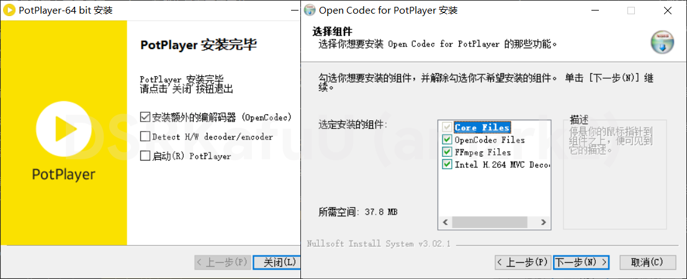

### LAVFilters

请直接至 [GitHub](https://github.com/Nevcairiel/LAVFilters/releases) 下载最新版本，写下文章时的版本为 0.75.1。

安装过程勾选 LAV Video Decoder (x64)、LAV Audio Decoder (x64) 和 LAV Splitter Source (x64) 即可。

## 配置 PotPlayer

### 关闭所有内置图像滤镜

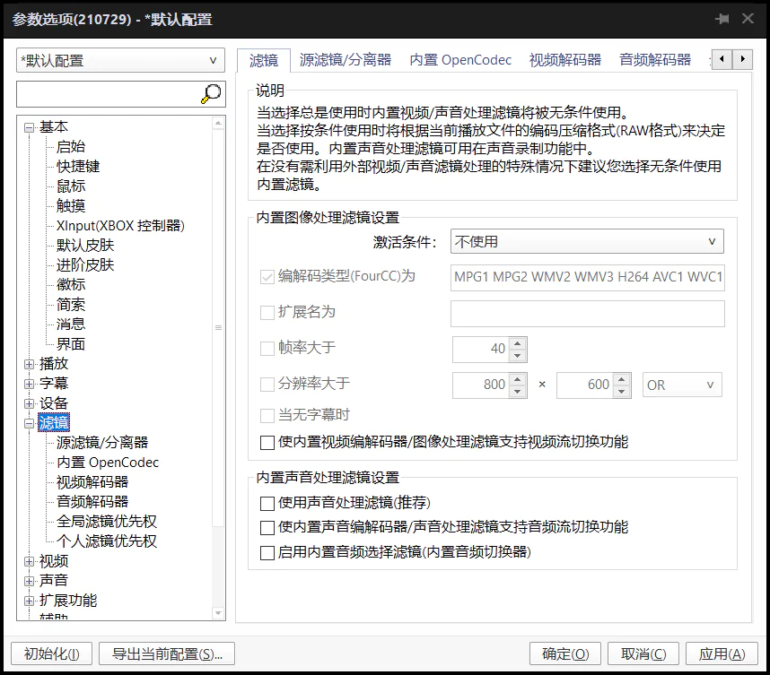

### 启用 LAVFilters

右击进入选项，进入下左图所示选项卡，选择 "滤镜/解码器管理"，点击下右图中所示 "搜索后添加"，此时左侧一栏会出现搜索到的滤镜，直接确定即可。

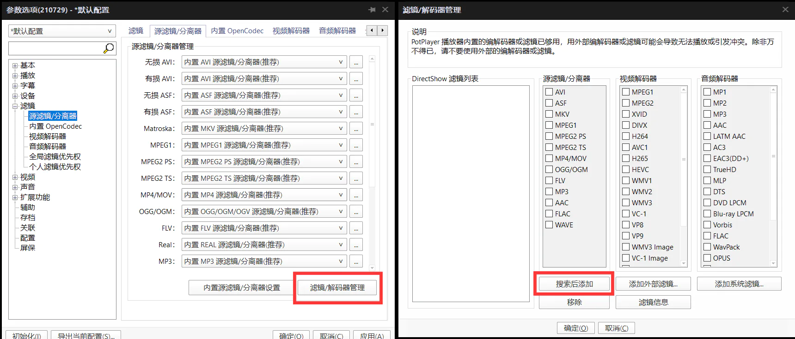

确定后，将 "源滤镜/分离器" 内如下图将所有可以设置为 LAV Splitter Source 的全部设置为它，"视频解码器" 内全部设置为 LAV Video Decoder，音频解码器内全部设置为 LAV Audio Decoder。

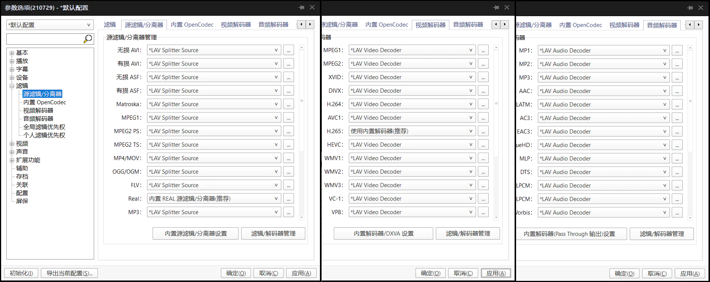

### 视频渲染设置

渲染器设为 D3D11，尺寸调整使用 Lanczos 3。"色系/属性" 选项卡，设置 YCbCr<->RGB 规则自动选择。

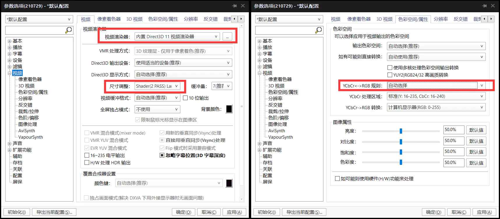

### 音频渲染设置

音频输出改为 WASAPI 渲染器，关闭让声音变得极其难受的规格化。

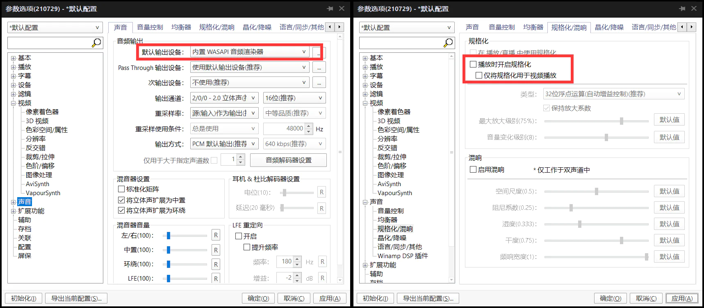

## 测试 LAVFilters 启用状态

此时随便打开一个视频，使用 `Tab` 键打开信息覆盖层，应该能看到如下图情况，则已正常启用。

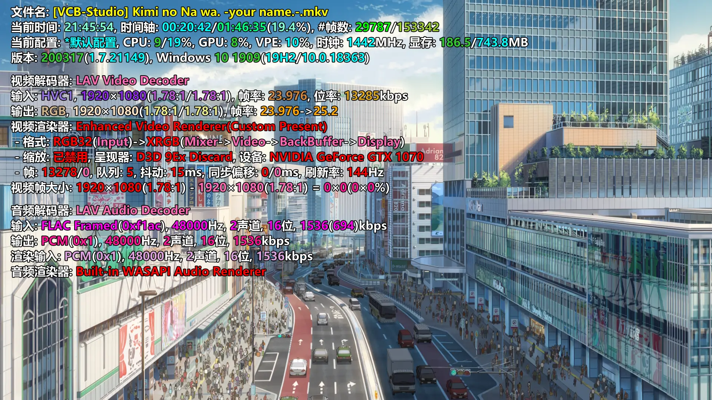

## 设置 LAVFilters

重新右击进入选项，如下图选项卡选择任意为 LAV Splitter Source 右侧的 "..." 按钮，进入分离器设置，如下图打开系统托盘图标便于切换音视频轨道。(当然使用播放器自带亦可)

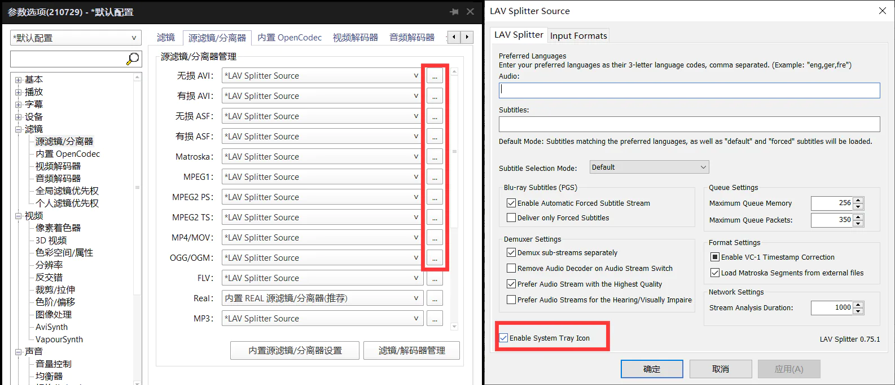

同理在 "视频解码器" 选项卡进入 LAV Video Decoder 设置，如下图，输出格式只保留 RGB24 和 RGB32，右上角硬件解码部分选择 D3D11 并且勾选所有格式。

同时在 "音频解码器" 选项卡进入 LAV Audio Decoder 设置，开启 Mixing，物理多声道玩家除外；关闭 Clipping Protection 以避免对音频动态范围产生影响。

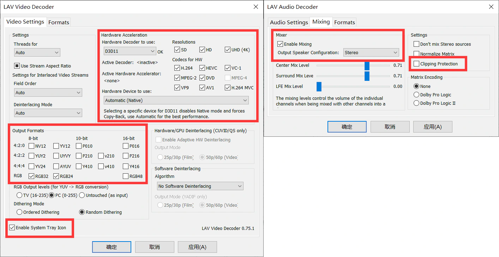

至此，设置已经基本完成，可以投入使用了。

## 优化字幕渲染

进入字幕设置，如下图所示设置字体渲染方式、字幕样式，勾选尽可能将字幕输出在画面底部，将字幕缓冲量设置为 0 即可：

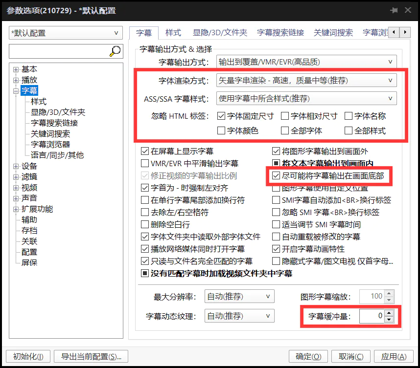

## 旧软解配置方案

对于使用 D3D11 硬解出现问题的情况，可以使用旧的软解方案。

渲染器设为 EVRCP，尺寸调整使用 Lanczos 3，同时在上文提及的 LAV Video Decoder 设置中将右上角的硬解解码部分置为 None：

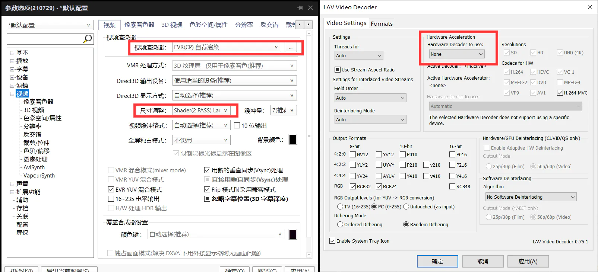
