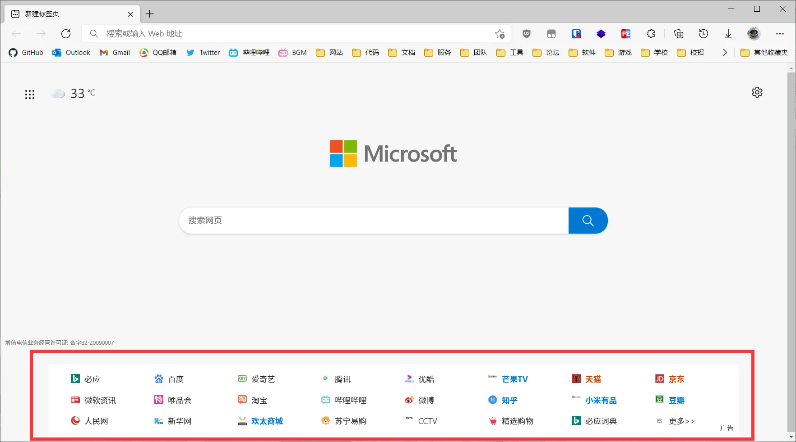
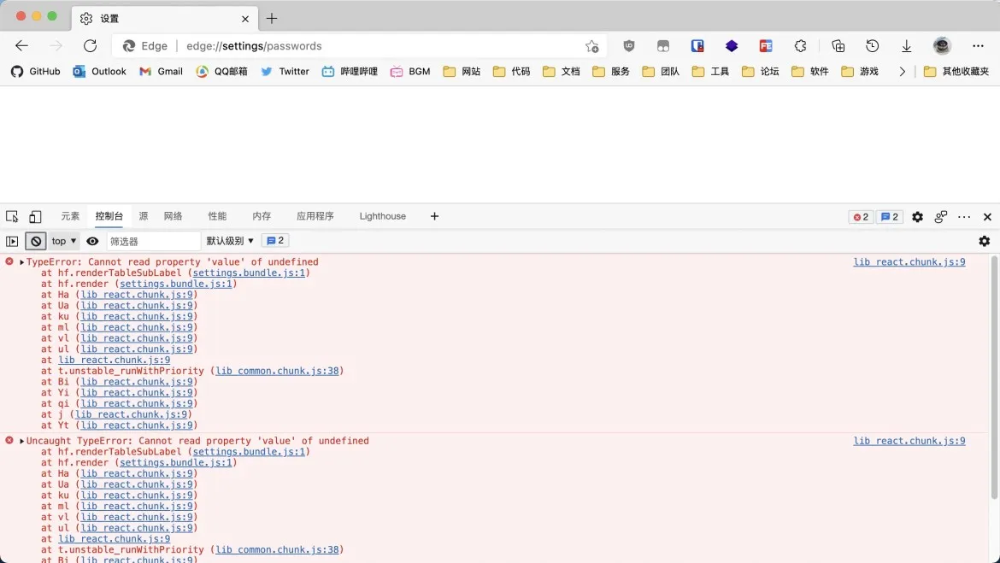
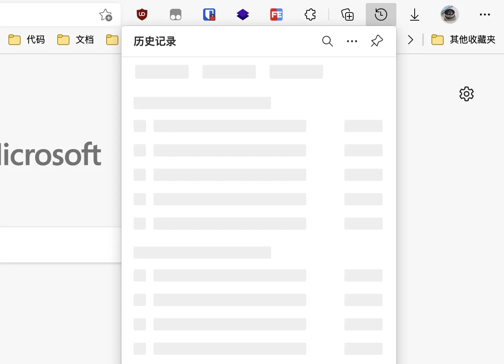
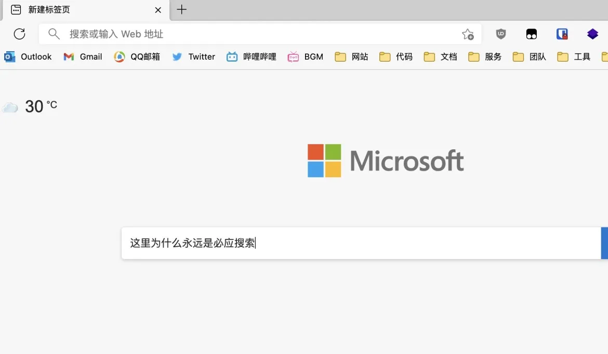
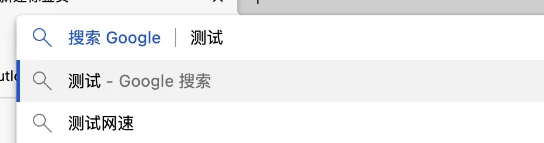

在最初微软公布基于 Chromium 的新版 Edge 时我是非常高兴的，对于中国大陆的用户来说，终于有一款能稳定使用云服务的 "大厂出品" 国际版浏览器了。如今距离发布已经快两年过去了，新版 Edge 的问题依旧多到数不清，事实证明微软依旧还是那个微软。

<!--more-->

这篇文章主要列举几个最让我难以忍受的问题，希望微软上点心赶紧把问题修了，而不是不停的添加 "数学运算器" 这种对浏览器来说可有可无的功能。除此之外，本文章内所有提及 Firefox 的地方均指 Mozilla 国际版，其下载地址为[此处](https://www.mozilla.org/zh-CN/firefox/all/)，可以归类为垃圾的大陆谋智版不在讨论范围内。

## 永远修不好的新标签页

Edge 的新标签页可能是世界上最难写的代码，从发布至今，新标签页的样式不是横向溢出就是纵向溢出，过段时间又出现宋体许可证号。历经长久的时间终于把溢出修复之后，又出现了高度设置错误的白屏问题，实在令人难以忍受：

截至 2020 年 8 月 24 日，白屏问题终于修复了，取而代之的是不可关闭的广告栏和依旧溢出的垂直高度：

## 设置项白屏

微软和 Mozilla 一样选择了 React 来写设置面板，但不知是没用 TS 还是完全没上心，密码面板在 macOS 版本上已经超过一个月无法正常使用了，来自前端开发者永远的噩梦，`Cannot read property 'value' of undefined`：

## 加载十年的历史记录

自从更换为 Popup 弹出框后，Edge 的历史记录从来不会在一秒内显示出来，只要使用历史记录，盯着骨架屏等待是不可避免的：

## 奇怪的新标签页搜索设计

不知是从哪个版本起，近期在设置内将搜索引擎设置为 Google 后，地址栏确实能正常使用，但新标签页的搜索框却永远锁定为 Bing；虽然确实在设置内将 "新标签页上的搜索使用搜索框或地址栏" 设置为 "地址栏" 后能解决，但输入文字就跳到地址栏的设计实在是反人类：

## 上古时代的搜索设计

和 Chrome 一样，临时切换搜索引擎需要输入相应的关键词并空格，Firefox 的点击即更换在这两者面前就像是计算机发展了二十年后的先进产物：

## 还有更多

WebKit 发虚的低分屏字体渲染就不说了，除了问题不修、新标签页等上文已经提到的问题，还有令人讨厌的 Microsoft AutoUpdate 等更多等着用户去发现。

总而言之，微软依旧是那个微软，我也因此换回了世界上最棒的 [Mozilla Firefox](https://www.mozilla.org/zh-CN/firefox/all/)。
