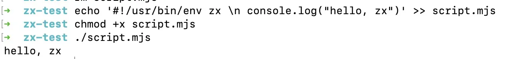
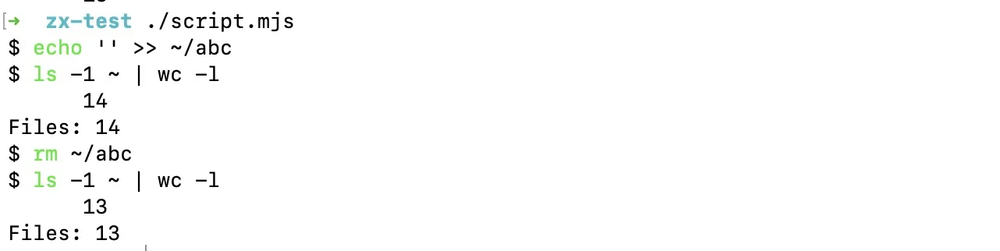

在编写一些复杂脚本做处理的时候，比起传统 shell 脚本，由于对 JS 更加熟悉，我更倾向于使用 JS 来编写。但一旦涉及到文件相关操作，几条 shell 指令肯定是更加方便的，但 Node 本身的 `child_process` 又差了那么点意思，手感并不是很好。

<!--more-->

今年初发布的 [zx](https://github.com/google/zx) 包于近日更新了 2.0 版本，它本质上是一个对原生 `child_process` 的包裹，提供了对传参等操作和部分默认行为的优化。同时它还是基于 Promise 的，因此可以随心所欲的在异步函数中使用。

作为一个常规的 npm 包，安装部分不再多说了，Node 肯定是需要的，直接进入使用部分。

## 基本使用

首先创建一个可运行的 zx 脚本：

```bash
echo '#!/usr/bin/env zx \n console.log("Hello, zx")' >> script.mjs
chmod +x script.mjs
```

指定运行环境为 zx 后，我们就可以像普通 shell 脚本一样直接运行 zx 脚本了。



## 执行 shell 指令

当需要执行 shell 指令时，使用 `$` 符号和模板字符串对其进行包裹即可，其内部使用了 `child_process` 的 `spawn`，返回值类型为 `ProcessPromise<ProcessOutput>`。

例如，尝试创建删除文件并显示目录内文件个数：

```js
await $`echo '' >> ~/abc`;
let count = parseInt(await $`ls -1 ~ | wc -l`);
console.log(`Files: ${count}`);
await $`rm ~/abc`;
count = parseInt(await $`ls -1 ~ | wc -l`);
console.log(`Files: ${count}`);
```



又或者是在一些录播脚本中并发上传文件：

```js
const HOST = '1.1.1.1:3000';
let files = ['a.mp4', 'b.mp4'];
let target = '/home/ubuntu/rsync';
await Promise.all(files.map((filename) => $`rsync -azP ./${filename} ${HOST}:${target}`));
```

同时，zx 也支持错误处理：

```js
try {
  await $`exit 1`;
} catch (p) {
  console.log(`Exit code: ${p.exitCode}`);
  console.log(`Error: ${p.stderr}`);
}
```

## 内置函数和工具库

除此之外 zx 还对一些常用指令和工具库进行了包裹以方便使用：

```js
// shell cd
cd('/tmp');

// node-fetch 包
const res = await fetch('https://wttr.in');
if (res.ok) {
  console.log(await res.text());
}

// readline 包
const env = await question('Choose a env: ', {
  choices: Object.keys(process.env),
});

// setTimeout 实现的 sleep
await sleep(1000);

// 彩色输出 chalk
console.log(chalk.blue('This is blue'));

// fs-extra
const content = await fs.readFile('package.json');
```

## 额外的 Polyfill

zx 为 esm 脚本添加了一些额外的 polyfill 以方便使用：

```js
// __filename 和 __dirname
console.log(__filename, __dirname);
// require
const { version } = require('package.json');
```

## 参考

- [google/zx](https://github.com/google/zx)
