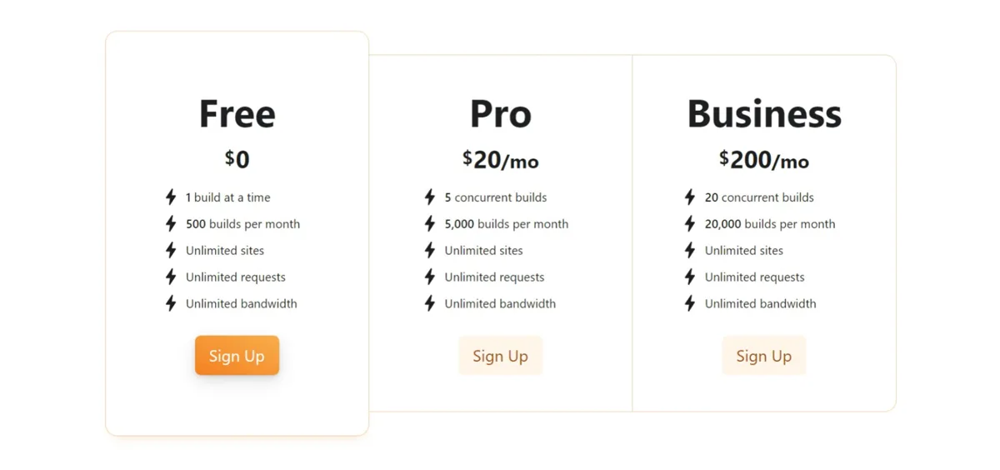
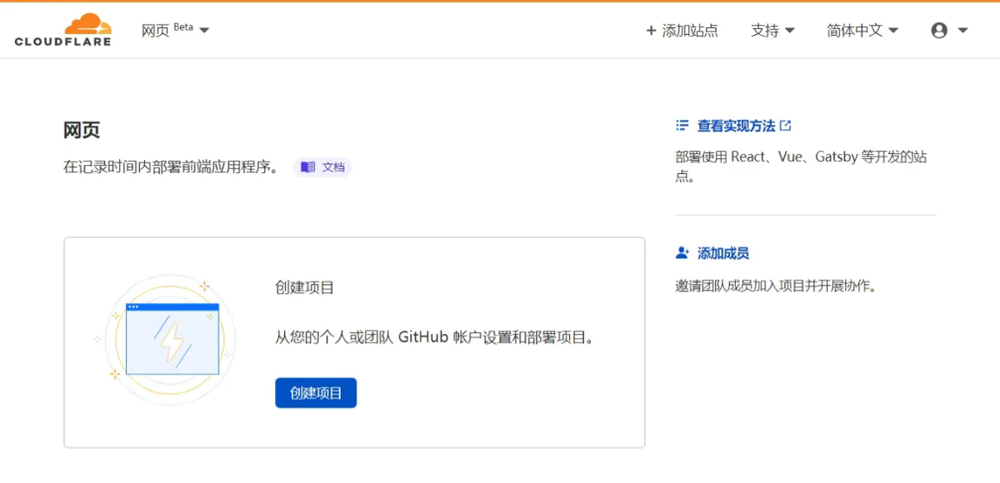
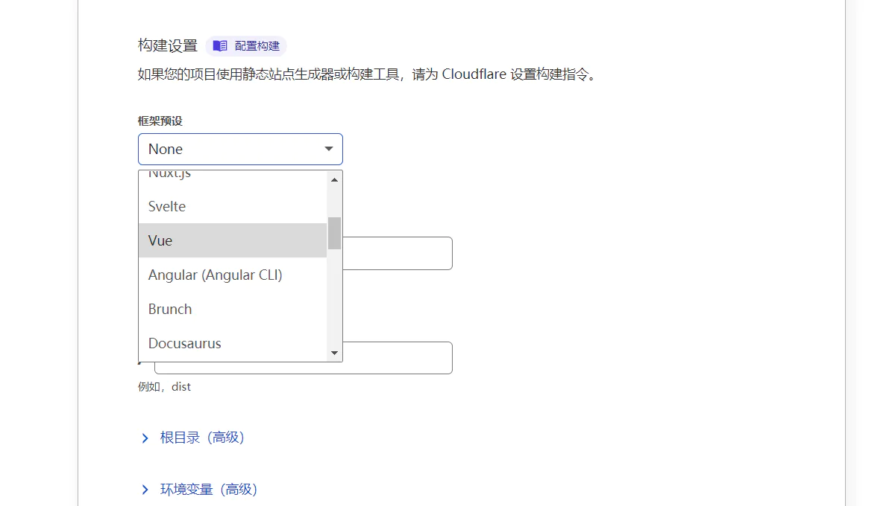
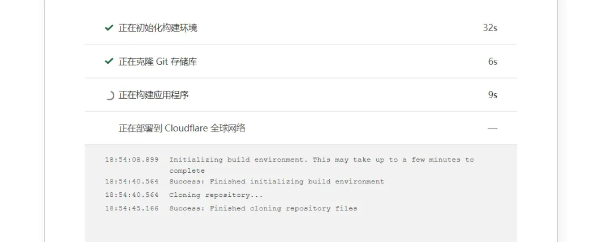
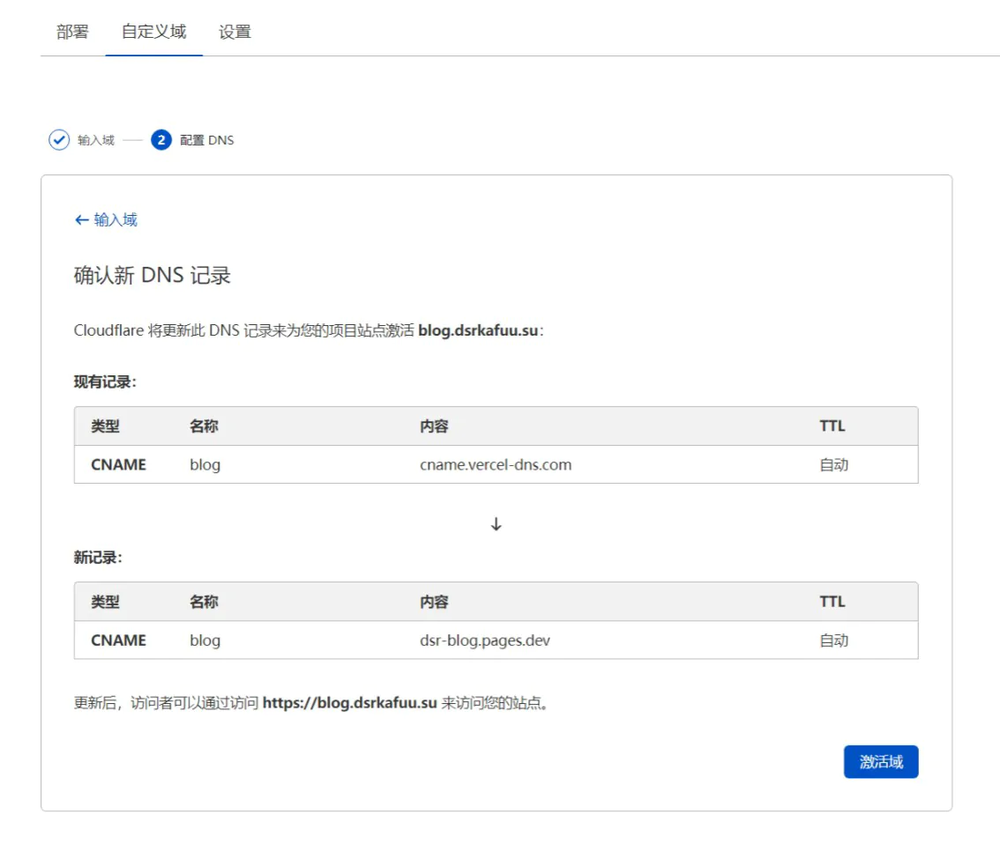
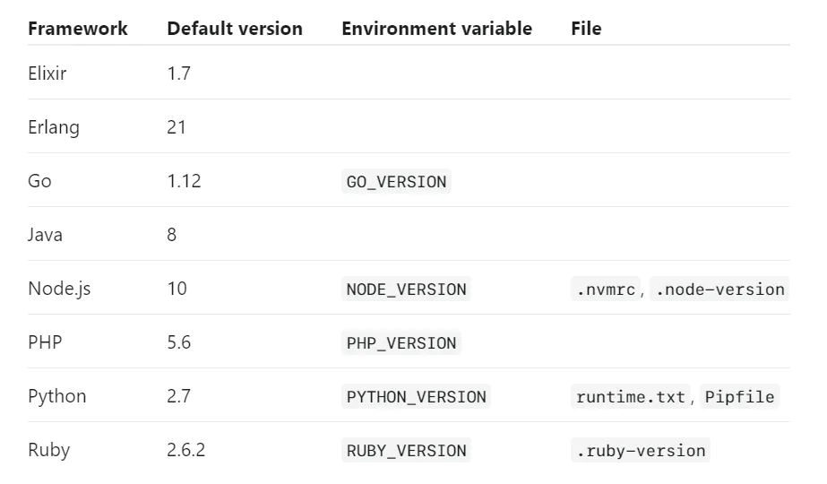

今日听闻 CloudFlare 的全新网页托管服务 [CloudFlare Pages](https://pages.cloudflare.com/) 正式进行开放测试，立刻进行了一番尝试。继前人 GitHub Pages、Netlify 和后人 Vercel (Zeit) 之后，终于又出现了一个免费用户完全不限带宽的服务。

<!--more-->

## 服务详情

CloudFlare Pages 向免费用户提供了无限的站点数、请求数和带宽，除此之外付费用户可以获得更多的构建次数和同时构建站点数：

开放测试后，在 CloudFlare 管理面板导航栏即可找到 Pages 服务 (简体中文为 "网页")：

## 添加站点

点击 "创建项目" 后，需要在 GitHub 账户上配置好 CloudFlare Pages 的 Application。

配置完成后，即可选择项目、添加站点：

CloudFlare Pages 和其他服务一样，支持大多数传统静态站点和 SPA 单页应用，但截至目前为止配置项等相对较少。

添加完成后，即可看到构建过程；就个人体验来说，目前 CloudFlare Pages 的构建速度相比于目前我大多数个人项目使用的 Vercel 来说相对要慢一点：

## 配置域名

站点构建完成后即可通过 CloudFlare 提供的 `pages.dev` 子域名访问，同时切换至 "自定义域" 面板还可添加无限制的自定义域名：

目前 Pages 无法像 Vercel 一样自定义多域名的跳转，需要通过域名 DNS 提供商实现；需要注意的是如果你的域名是托管在 CloudFlare DNS 的，那么可以正常开启 CF 的代理。

## 高级设置

目前 Pages 提供的高级设置相对较少，仅可以设置分支、环境变量和最基础的构建设置，包括安装设置、SPA fallback 等均无法进行自定义。

Pages 文档中目前列出了截至目前 (2021-04-03) 已知的问题，以下是其内容的翻译：

- 删除拥有自定义域名的项目可能会导致在该域名上依旧可以访问上一次的构建，需要完全移除 DNS 记录以解决问题
- 目前没有提供自定义的路由跳转，访问不存在的页面时首先会尝试提供 `404.html` 文件，若该文件不存在，则会 fallback 至 `index.html` 以支持 SPA 路由
- 预览 URL 不支持 Access
- 目前仅支持部署 GitHub，且不支持一次性部署 monorepo 中的多个项目
- 目前无法更改 GitHub repo 和 Pages 项目的关联，需要删除重建以解决问题
- 目前分配的 `pages.dev` 域名无法更改，需要删除重建以解决问题
- Hugo 项目构建会默认使用旧版本，需要手动设置 `HUGO_VERSION` 环境变量进行自定义
- 构建默认使用 Node.js 10，需要通过 `NODE_VERSION` 环境变量或 `.nvmrc` 文件进行自定义

